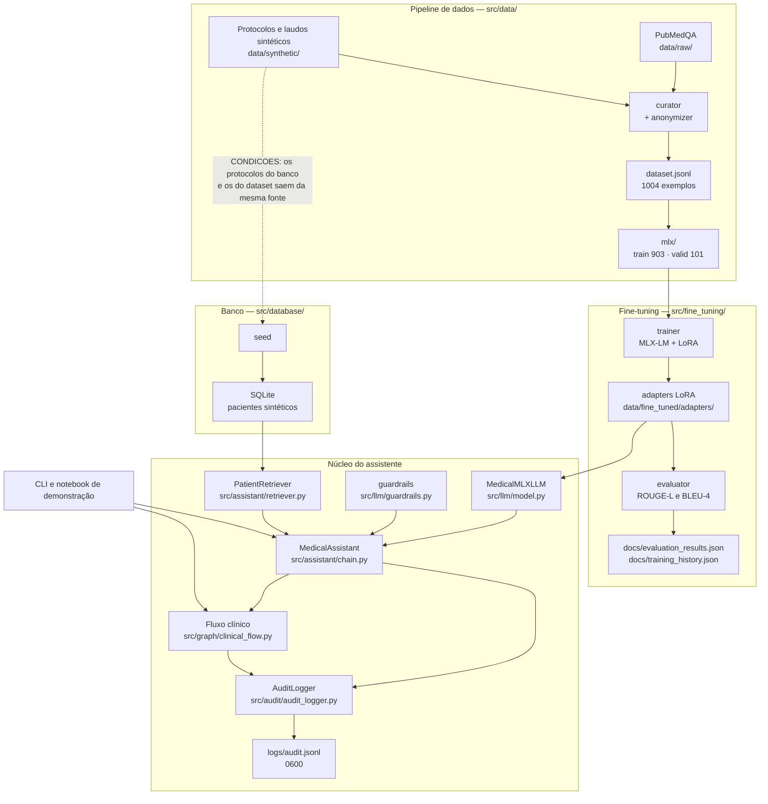
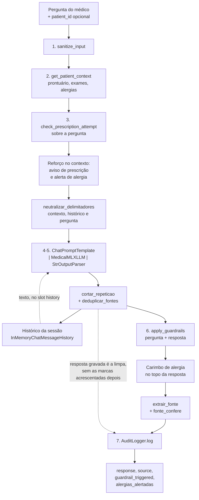
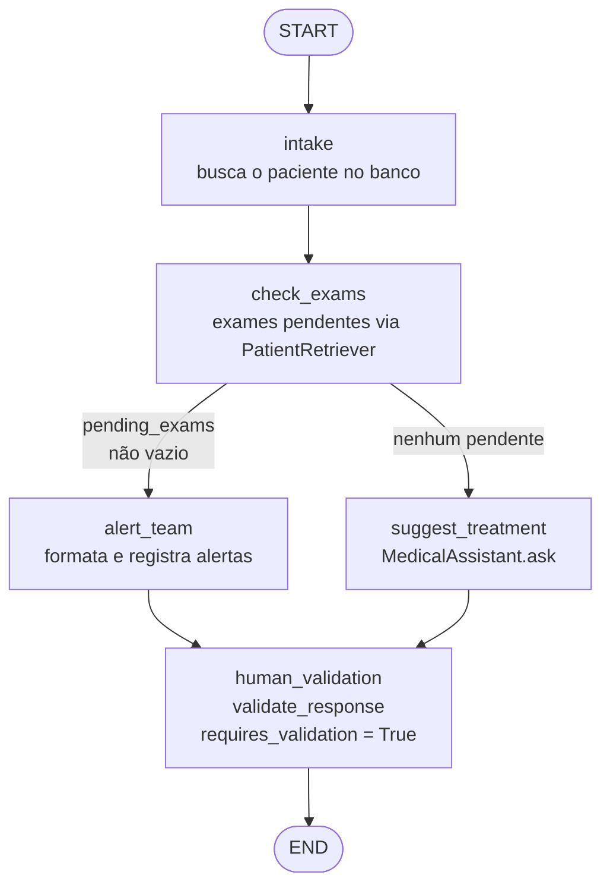

# Diagramas

> Tech Challenge Fase 3 — Grupo 24

Os três diagramas desta página são desenhados a partir do código, não do plano: a arquitetura
reflete os pacotes que existem em `src/`, o pipeline LangChain segue a ordem dos passos do
`MedicalAssistant.ask` e o fluxo LangGraph reproduz as arestas registradas em `build_graph`.
Onde o desenho e o código divergirem, o código é que vale — e o diagrama é que está errado.

---

## 1. Arquitetura geral

Três caminhos independentes convergem no assistente: o pipeline de dados, que produz o dataset
curado; o fine-tuning, que produz os adapters LoRA; e o banco de pacientes, que produz o
contexto clínico. O assistente é o único ponto que lê os três.

Duas ligações merecem leitura atenta, porque são decisões e não consequências:

- **O fluxo LangGraph chama o `MedicalAssistant`, não o LLM.** O plano do PR 08 dizia "chama
  LLM para sugerir conduta"; pelo assistente, a sugestão do ramo automatizado sai com o
  contexto montado, o alerta de alergia imposto por código, o rodapé de validação garantido e a
  trilha escrita. Pelo LLM cru, o ramo que roda sem ninguém olhando seria o caminho com menos
  garantias do sistema.
- **A trilha é a única saída persistente do núcleo.** O contexto clínico não é copiado para
  ela: já está no banco, e duplicá-lo num arquivo que é aberto no notebook e gravado no vídeo
  espalharia dado de paciente sem responder nenhuma pergunta de auditoria a mais.

---

## 2. Pipeline LangChain — `MedicalAssistant.ask`

A ordem dos passos é fixa. O que a torna uma garantia, e não uma sequência qualquer, é a
posição de dois deles: a sanitização vem **antes** de tudo, então o texto que entra no prompt é
o mesmo que vai para a trilha; e o guardrail vem **depois** da geração, então o rodapé de
validação humana existe mesmo quando o modelo ignora a instrução do prompt.

- **O histórico entra como texto, no slot `{history}`, e não como turnos de assistente.** Foi
  medido: injetado como turno `AI:`, a resposta da segunda pergunta saía 100% idêntica à da
  primeira, para perguntas diferentes — o modelo copiava a própria resposta anterior. Como
  texto dentro do bloco de dado, a similaridade cai para 24% e 10%. A causa é a mesma pela qual
  o wrapper não manda papel `system`: o modelo foi fine-tuned em pares soltos e nunca viu
  conversa multi-turno.
- **O que vai para o histórico é a resposta `limpa`**, sem o carimbo de alergia, sem o rodapé
  de validação e sem o aviso de prescrição. Realimentar essas marcas ensinaria o modelo a
  escrevê-las sozinho, e a marca deixaria de distinguir o que o guardrail garantiu do que o
  modelo inventou.
- **Fonte citada que não confere com o contexto é gravada como ausente**, e o aviso na tela sai
  com a fonte anonimizada — é o único ponto em que texto livre do modelo sai do fluxo sem
  passar pela trilha.

---

## 3. Fluxo clínico LangGraph — `build_graph`

Cinco nós, uma aresta condicional. Todas as arestas são explícitas, inclusive as duas que
chegam ao `human_validation`: o nó que impõe a validação humana não pode depender de o autor de
um ramo novo lembrar de ligá-lo.

- **Havendo exame pendente, o fluxo alerta e não sugere conduta.** Nesse ramo o modelo nem
  chega a ser chamado, e a razão é clínica: conduta sobre quadro cujo exame não voltou parece
  completa e não é.
- **A condicional decide por `pending_exams`, que o `check_exams` acabou de trazer do banco** —
  nunca por um sinalizador que tenha vindo de fora junto com a entrada. Caminho crítico se
  decide por dado que o próprio fluxo foi buscar na origem.
- **O `session_id` é validado por allowlist** antes de entrar no estado, porque daqui ele vai
  direto para a trilha de auditoria: até 64 caracteres entre letras, dígitos e `.`, `_`, `:`,
  `-`. A sessão default é um `uuid4` — identificador previsível deixaria quem lê a trilha
  enumerar as execuções vizinhas.
- **Para desenhar ou inspecionar o grafo sem carregar o modelo**, monte-o com as dependências
  já prontas ou com peças falsas: `build_graph()` sem argumento chama `Dependencias.from_env()`,
  que instancia o LLM.
