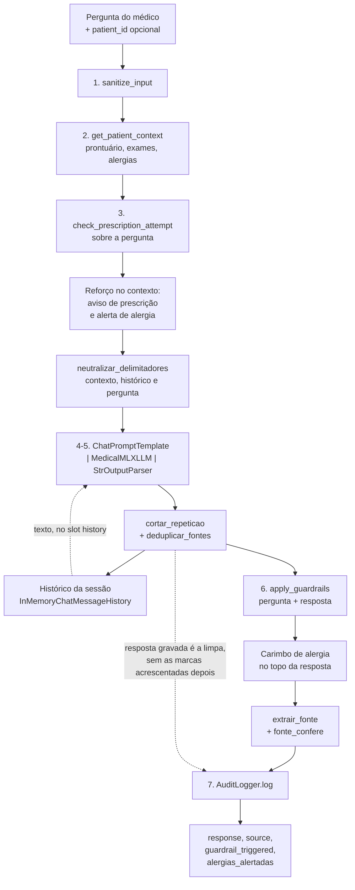

# Relatório técnico — Tech Challenge Fase 3

Assistente virtual médico com LLM fine-tuned, pipeline LangChain e fluxo de decisão
LangGraph.

**Grupo 24** · Pós Tech IADT · Fase 3

| | |
|---|---|
| Repositório | https://github.com/oryange/tech-challenge-group-24 |
| Modelo base | `meta-llama/Llama-3.2-3B-Instruct` |
| Adapter demonstrado | `data/fine_tuned/adapters` (500 iterações) |
| Vídeo | _(colar o link aqui antes do merge)_ |

---

## Sumário

1. [Introdução e objetivo](#1-introdução-e-objetivo)
2. [Arquitetura geral](#2-arquitetura-geral)
3. [Processo de fine-tuning](#3-processo-de-fine-tuning)
4. [O assistente médico e o pipeline LangChain](#4-o-assistente-médico-e-o-pipeline-langchain)
5. [Diagrama do fluxo LangChain](#5-diagrama-do-fluxo-langchain)
6. [Fluxo de decisão automatizado (LangGraph)](#6-fluxo-de-decisão-automatizado-langgraph)
7. [Avaliação do modelo](#7-avaliação-do-modelo)
8. [Análise dos resultados](#8-análise-dos-resultados)
9. [Segurança e validação](#9-segurança-e-validação)
10. [Dados: origem, anonimização e o que o repositório garante](#10-dados-origem-anonimização-e-o-que-o-repositório-garante)
11. [Conclusão e trabalhos futuros](#11-conclusão-e-trabalhos-futuros)

---

## 1. Introdução e objetivo

O desafio pede um assistente virtual médico treinado com os dados do próprio hospital, capaz
de apoiar condutas clínicas e responder dúvidas de médicos a partir dos protocolos internos, e
um fluxo de decisão automatizado que, ao receber um paciente, verifique exames pendentes,
sugira tratamentos e emita alertas para a equipe.

O sistema entregue faz as duas coisas, e a decisão de projeto que mais moldou o resultado foi
separá-las em duas responsabilidades distintas:

- **o que o modelo sabe** vem do fine-tuning com LoRA sobre protocolos, laudos, receitas,
  procedimentos e perguntas frequentes;
- **o que o modelo sabe sobre _este_ paciente** não vem do fine-tuning. Vem do banco, injetado
  no prompt a cada pergunta pelo pipeline LangChain.

A avaliação mostra que essa separação não foi só arrumação de código: é ela que faz o sistema
responder corretamente sobre um prontuário (seção 8.3), num modelo que, perguntado sem
contexto, recita o protocolo errado.

Um terceiro princípio atravessa o projeto inteiro e está na seção 9: **os limites de atuação
não podem depender de o modelo cooperar.** Um assistente clínico que só respeita a fronteira
quando a geração sai boa não tem fronteira nenhuma.

---

## 2. Arquitetura geral

```
src/
├── data/          preparação: download, anonimização, curadoria, sintéticos
├── fine_tuning/   configuração do LoRA, trainer MLX-LM, avaliador
├── llm/           wrapper LangChain do modelo MLX + guardrails
├── assistant/     MedicalAssistant (chain LCEL), retriever, prompts
├── database/      modelos SQLAlchemy e seed do banco sintético
├── graph/         fluxo clínico LangGraph
└── audit/         trilha de auditoria
```

O diagrama de arquitetura em Mermaid está em [`diagramas.md`](diagramas.md#1-arquitetura-geral).

As camadas se empilham em uma direção só. O `graph/` usa o `assistant/`, que usa o `llm/` e o
`database/`; nenhuma volta. A consequência prática aparece na seção 6: o fluxo automatizado
chama `MedicalAssistant.ask` em vez de falar direto com o LLM, e por isso herda contexto,
guardrail e trilha de auditoria sem reimplementar nada.

---

## 3. Processo de fine-tuning

### 3.1 Dados

Três origens, preparadas por `src/data/`:

| Origem | Registros | Conteúdo |
|---|---|---|
| PubMedQA | 1.000 | perguntas e respostas clínicas sobre publicações médicas (inglês) |
| Sintéticos do hospital | 100 | protocolos, laudos, receitas, procedimentos e FAQ (português) |
| **Dataset curado** | **1.004** | após deduplicação, anonimização e curadoria |

Os 100 sintéticos são gerados por `src/data/synthetic_generator.py` e representam os "dados
próprios do hospital" que o enunciado pede: 60 perguntas frequentes de médicos, 10 protocolos,
10 modelos de laudo, 10 de receita e 10 de procedimento, todos ancorados em CID-10.

O preprocessing tem três etapas, nesta ordem: **anonimização** (`anonymize_record`, aplicado
pelo curator sobre cada registro), **curadoria** (descarte de vazios e duplicatas) e
**formatação** para o par `{prompt, completion}` que o MLX-LM consome.

Divisão final: **903 exemplos de treino** e **101 de validação**. Nenhum exemplo foi descartado
por tamanho ou por falta de texto — o `training_history.json` registra zero nos dois contadores.

### 3.2 Composição do conjunto de treino

Os números abaixo saem de `data/processed/mlx/train.jsonl` cruzado com a origem registrada em
`data/processed/dataset.jsonl`. Eles explicam boa parte do comportamento do modelo e voltam na
análise:

| Medida | Valor |
|---|---|
| PubMedQA (inglês) | 812 (89,9%) |
| Sintéticos do hospital (português) | 91 (10,1%) |
| Exemplos que citam `[Fonte:` na resposta | 91 (10,1%) |
| Exemplos que respondem sobre **dado estruturado de paciente** | **0** |

Duas observações que não são evidentes na tabela:

- **Os 91 exemplos que citam fonte são exatamente os 91 sintéticos em português.** Nenhum
  exemplo do PubMedQA cita fonte, e todos os sintéticos citam. A correlação é perfeita, e a
  seção 8.4 mostra o que ela produz na inferência.
- **Zero exemplos de treino têm prontuário no prompt.** O que o sintético traz na entrada é um
  rótulo de condição (`Condição: asma (CID-10 J45).`), nunca exames pendentes, alergias ou
  histórico. O formato que o assistente usa em produção — contexto estruturado de paciente na
  entrada — o modelo nunca viu no treino.

### 3.3 Hiperparâmetros

LoRA via MLX-LM, nativo em Apple Silicon. Valores lidos de `docs/evaluation_results.json`:

| Parâmetro | Valor |
|---|---|
| Modelo base | `meta-llama/Llama-3.2-3B-Instruct` |
| Camadas com LoRA (`lora_layers`) | 8 |
| Rank | 8 |
| Alpha | 16,0 |
| Scale no MLX (`alpha / rank`) | 2,0 |
| Dropout | 0,0 |
| Learning rate | 1e-4 |
| Iterações | 500 |
| Batch size | 4 |
| `max_seq_length` | 1.024 |
| Batches de validação | 25 |
| Seed | 42 |

O MLX-LM declara `scale` e não `alpha` — é a razão de `lora_scale_mlx` existir como campo
próprio no `LoRAConfig`, que é a fonte única dos hiperparâmetros para o trainer, o evaluator e
os notebooks.

O treino está registrado em [`notebooks/02_fine_tuning.ipynb`](../notebooks/02_fine_tuning.ipynb),
com as curvas de loss e a chamada real do MLX-LM.

---

## 4. O assistente médico e o pipeline LangChain

`MedicalAssistant` (`src/assistant/chain.py`) integra a LLM customizada, consulta a base
estruturada e contextualiza a resposta — os três itens que o enunciado pede do LangChain.

**Integração da LLM customizada.** `MedicalMLXLLM` (`src/llm/model.py`) estende `LLM` do
`langchain_core` e carrega o modelo base mais o adapter LoRA. A chain é LCEL:
`ChatPromptTemplate | MedicalMLXLLM | StrOutputParser`.

**Consulta à base estruturada.** `PatientRetriever` (`src/assistant/retriever.py`) lê o banco
SQLite pelo ORM do SQLAlchemy — pacientes, exames, consultas e protocolos. O `patient_id` passa
por allowlist antes de chegar à consulta.

**Contextualização.** `get_patient_context` monta o bloco com prontuário, exames, alergias e
histórico de consultas, e ele entra no prompt como dado delimitado. O histórico da conversa
entra como **texto** no slot `{history}`, e não como turnos `AI:` de um `MessagesPlaceholder`.
Não é estilo: injetado como turno de assistente, a resposta da segunda pergunta saía 100%
idêntica à da primeira para perguntas diferentes — o modelo copiava a própria resposta. Como
texto dentro do bloco de dado, a similaridade cai para 24% e 10%. A causa é a mesma pela qual o
wrapper não manda papel `system`: o modelo foi fine-tuned em pares soltos e nunca viu conversa
multi-turno.

---

## 5. Diagrama do fluxo LangChain

A ordem dos sete passos é fixa. O que a torna uma garantia, e não uma sequência qualquer, é a
posição de dois deles: a sanitização vem **antes** de tudo, então o texto que entra no prompt é
o mesmo que vai para a trilha; e o guardrail vem **depois** da geração, então o rodapé de
validação humana existe mesmo quando o modelo ignora a instrução do prompt.



> Este diagrama é reproduzido de [`diagramas.md`](diagramas.md#2-pipeline-langchain--medicalassistantask),
> que é a fonte a atualizar quando o pipeline mudar. Ele aparece aqui porque o enunciado o pede
> nominalmente entre os itens do relatório técnico.

---

## 6. Fluxo de decisão automatizado (LangGraph)

Cinco nós e uma aresta condicional (`src/graph/clinical_flow.py`):

```
intake → check_exams ─┬─ (pendentes > 0) → alert_team ────────┬→ human_validation
                      └─ (sem pendências) → suggest_treatment ┘
```

A decisão sai de `pending_exams`, que o `check_exams` acabou de ler do banco — não de um
sinalizador vindo de fora junto com a entrada. Caminho crítico decidido por dado que o próprio
sistema buscou.

Três escolhas de projeto merecem registro:

- **`suggest_treatment` chama `MedicalAssistant.ask`, não `llm.invoke`.** É a decisão mais
  importante do arquivo. Pelo assistente, a sugestão sai com contexto do paciente, com o alerta
  de alergia imposto por código, com o rodapé de validação garantido pelo guardrail e com a
  interação registrada na trilha. Falando direto com o LLM, nada disso valeria dentro do grafo —
  e o fluxo automatizado, que é justamente o que roda sem ninguém olhando, seria o caminho com
  menos garantias do sistema inteiro.
- **`alert_team` não chama o modelo.** Quando há exame em aberto, o fluxo não sugere conduta:
  alerta a equipe e para. É determinístico e auditável.
- **`human_validation` é o nó de saída dos dois ramos**, e não um passo do ramo que sugere
  conduta. Ele levanta `requires_validation` — a forma verificável por programa — e passa a
  sugestão por `validate_response` — a forma legível por quem lê o texto.

O diagrama está em [`diagramas.md`](diagramas.md#3-fluxo-clínico-langgraph--build_graph) e a
execução dos dois ramos está na célula 6 de
[`notebooks/03_langchain_demo.ipynb`](../notebooks/03_langchain_demo.ipynb).

---

## 7. Avaliação do modelo

### 7.1 Protocolo

`src/fine_tuning/evaluator.py`, sobre **50 amostras** do conjunto de validação, `max_tokens`
256, mesma seed e mesmo `chat_template` do treino — servir outro template mediria a diferença
de formatação em vez da diferença de modelo.

Métricas: **ROUGE-L** (maior subsequência comum, sensível a ordem e cobertura) e **BLEU-4**
(precisão de n-gramas até 4). Ambas comparam a geração com a resposta de referência.

### 7.2 Resultados

Três séries. Os valores saem de `docs/evaluation_results.json`:

| Série | Adapter | ROUGE-L | BLEU-4 |
|---|---|---|---|
| Baseline (sem adapter) | `null` | 0,1746 | 3,42 |
| **Fine-tuned (500 iterações)** | `data/fine_tuned/adapters` | **0,2904** | **16,08** |
| Melhor checkpoint (200 iterações, `val_loss` 1,672) | `data/fine_tuned/adapters_best` | 0,2741 | 12,61 |

Ganho do modelo entregue sobre o baseline:

| Métrica | Delta | Variação |
|---|---|---|
| ROUGE-L | **+0,1157** | +66% |
| BLEU-4 | **+12,65** | +370% |

### 7.3 Qual adapter o sistema demonstrado carrega

O `ADAPTER_PATH` padrão é **`data/fine_tuned/adapters`** — o de 500 iterações
(`src/fine_tuning/config.py`). É o que a célula 2 do notebook de demonstração imprime a partir
de `_identifying_params`, e é o que responde as demais células.

O registro importa: as métricas desta seção são as **do sistema que o vídeo grava**, e não as de
um checkpoint melhor que ficou na gaveta. O `adapters_best` está versionado e é a série de
comparação da seção 8.1, não o que roda.

### 7.4 Curvas de loss

De `docs/training_history.json`:

| Iteração | Validation loss |
|---|---|
| 1 | 3,083 |
| 50 | 1,828 |
| 100 | 1,728 |
| 150 | 1,692 |
| **200** | **1,672** ← mínimo |
| 250 | 1,676 |
| 300 | 1,688 |
| 350 | 1,691 |
| 400 | 1,677 |
| 450 | 1,676 |
| 500 | 1,749 |

A loss de treino cai de 2,455 (iteração 10) a 1,378 (iteração 500), com mínimo de 1,066 na 490.

A leitura convencional é direta: treino descendo, validação subindo depois da iteração 200 —
overfitting a partir dali, e o checkpoint a escolher seria o de 200. A seção 8.1 mostra por que
essa leitura estaria errada aqui.

As curvas plotadas estão em [`notebooks/02_fine_tuning.ipynb`](../notebooks/02_fine_tuning.ipynb).

---

## 8. Análise dos resultados

### 8.1 Menor validation loss não é melhor geração

É o achado mais interessante da rodada, e ele contraria a heurística padrão.

| | `val_loss` | ROUGE-L | BLEU-4 |
|---|---|---|---|
| Checkpoint 200 | **1,672** (melhor) | 0,2741 | 12,61 |
| Checkpoint 500 | 1,749 (pior) | **0,2904** | **16,08** |

O checkpoint com a **melhor** loss de validação pontua **pior** nas duas métricas de geração. A
diferença no BLEU-4 é de 27%, não é ruído.

A explicação está no que cada número mede. A `val_loss` é perplexidade token a token: mede o
quanto o modelo se surpreende com o texto de referência, com _teacher forcing_, sempre
condicionado ao prefixo correto. ROUGE-L e BLEU-4 medem o texto que o modelo **de fato gera**,
condicionado às próprias escolhas anteriores. Entre as iterações 200 e 500 o modelo continuou
absorvendo o registro de escrita das respostas — frases curtas, declarativas, sem enumeração —
e isso melhora a geração livre enquanto piora ligeiramente a perplexidade sobre a referência.

A consequência prática é a que está na seção 7.3: o modelo entregue é o de 500 iterações, e
quem tivesse aplicado a regra "pegue o de menor validation loss" teria entregado o pior dos
dois. Selecionar checkpoint por `val_loss` em tarefa de geração é escolher pelo proxy quando a
métrica de interesse está disponível.

### 8.2 O que o fine-tuning mudou, exemplo a exemplo

Os exemplos abaixo são os registrados em `docs/evaluation_results.json`, mesmo prompt nas duas
séries.

**Prompt:** _"Does rugby headgear prevent concussion?"_ (o estudo é sobre **atitudes** de
jogadores e treinadores, não sobre eficácia)

| | Resposta |
|---|---|
| Referência | "Although most players in the study believe that rugby headgear may prevent concussion, only a minority reported wearing it. Coaches tended to be less convinced than the players…" |
| **Baseline** | "**No, the study found that rugby headgear does not prevent concussion.** Despite the players' belief… only a minority (27%) reported wearing headgear…" |
| **Fine-tuned** | "The use of headgear to prevent concussion is not a guarantee. The results of this study suggest that the players believe that the headgear can help prevent concussion, but the coaches are less convinced." |

O baseline responde a pergunta que **não** foi feita: afirma que o equipamento não previne
concussão, conclusão que o estudo não sustenta porque ele nem investigou isso. O fine-tuned se
mantém no que o texto diz.

**Prompt:** _"The use of audit to identify maternal mortality… is it just a difference between
the rich and the poor?"_

| | Resposta |
|---|---|
| Baseline | "**The article highlights the importance of** maternal mortality audits in identifying the causes…" |
| Fine-tuned | "The use of maternal mortality audit to identify causes of maternal deaths **is not limited to the poor**…" |

O padrão se repete nos três exemplos e é o que os +12,65 pontos de BLEU-4 medem: o baseline
escreve **sobre** o artigo, em registro de chatbot ("The article highlights…", "Yes, the study
found that: 1. …"); o fine-tuned escreve a **conclusão**, no registro declarativo e curto em que
as referências do PubMedQA estão escritas.

Isso é uma melhora real e é a que as métricas capturam. Mas é importante nomeá-la pelo que ela
é: **alinhamento de registro e de fidelidade à fonte**, não aquisição de conhecimento clínico
novo. ROUGE-L e BLEU-4 são métricas de sobreposição de texto — elas não sabem distinguir uma
conduta correta de uma conduta errada escrita no formato certo.

### 8.3 Contexto do paciente resolve o que o fine-tuning não resolveu

O contraste mais forte da entrega está entre duas células do notebook de demonstração, na mesma
execução, com o mesmo modelo e minutos de diferença.

**Sem contexto** (célula 3) — pergunta sobre sinais de alarme na gastroenterite aguda:

> `[Fonte: protocoloCID J45]` Para gastroenterite aguda (CID J45), o exame de referência é
> avaliação clínica. Solicitar eletrocardiograma quando houver dúvida diagnóstica…

Três defeitos numa resposta: **J45 é o CID da asma**, não da gastroenterite (A09); a citação
saiu malformada, sem o espaço; e a conduta sugere eletrocardiograma para um quadro
gastrointestinal. A conferência do `chain.py` rejeitou a fonte e gravou `tem_fonte=False`.

**Com contexto** (célula 5) — mesma sessão, `patient_id=[PACIENTE_005]`:

> `[Fonte: exames PENDENTES (aguardando realização ou resultado)]` Exame pendente: hemoglobina
> glicada (CID E11). Solicitado em 02/09/2026.

Correto, e conferível: `[PACIENTE_005]` tem exatamente um exame pendente, `hemoglobina glicada`,
solicitado em `02/09/2026`. Tipo e data batem com o prontuário, e a fonte citada conferiu contra
o contexto (`tem_fonte=True`).

A conclusão é a que justifica a arquitetura da seção 1: **para pergunta sobre paciente, o que
resolve é a recuperação de contexto, não o fine-tuning.** Um modelo de 3B com LoRA de 8 camadas
sobre 903 exemplos não vai memorizar prontuário — e não precisa. O fine-tuning entrega o
registro e o vocabulário; o pipeline LangChain entrega o fato.

### 8.4 Limitações medidas

Estas não são limitações genéricas de LLM: são medidas neste dataset e neste modelo, e cada uma
tem número.

**Explainability é cobrada na inferência e quase não foi treinada.** O `SYSTEM_PROMPT` exige
citação de fonte em **toda** resposta, mas só **91 dos 903** exemplos de treino (10,1%) citam
fonte — e são exatamente os 91 sintéticos em português. Nenhum dos 812 do PubMedQA cita. O
modelo aprendeu que "citar fonte" é uma marca do registro sintético em português, não uma regra
geral, e improvisa quando a cobra fora dele: `[Fonte:protocoloCID J45]`, `[Fonte: avaliação:E11]`.
É a origem direta do que a seção 8.3 mostra.

**Zero exemplos de treino respondem sobre dado estruturado de paciente.** O formato que o
assistente usa em produção nunca apareceu no treino. Que a célula 5 funcione é mérito da
capacidade de leitura de contexto que o modelo base já tinha, não do fine-tuning.

**Desequilíbrio 89,9% / 10,1% entre inglês e português.** O treino é dominado por PubMedQA
enquanto o uso é em português sobre protocolo interno. A alucinação medida durante a integração
— "meta de glicemia below 6.5 mmol/l", com palavra em inglês e unidade errada (hemoglobina
glicada é medida em %) — é o sintoma direto.

**O guardrail de prescrição casa radicais, não intenção.** `check_prescription_attempt` detecta
`prescr*`, `receit*` e `administr*`. Posologia escrita sem nenhum desses radicais não é
detectada como tentativa de prescrição. A segunda camada continua valendo — `validate_response`
impõe o rodapé em toda resposta —, então o efeito é perder o `AVISO_PRESCRICAO` no topo, não
perder a exigência de validação humana.

**A marca de validação é forjável pelo modelo.** `_MARCA_VALIDACAO_NO_FIM` aceita a marca
escrita pelo próprio modelo, e o `validate_response` não duplica o rodapé quando já existe um.
Um modelo que aprendeu a escrever a marca sozinho produz uma resposta indistinguível de uma
carimbada pelo guardrail. Está registrado e não corrigido: a correção é fazer o carimbo
distinguível da imitação, o que muda o formato da marca em toda a base.

### 8.5 Limitações estruturais

Ficam registradas porque limitam o teto, mas não explicam os achados acima — que são do dataset:

- **903 exemplos de treino** é pouco para fine-tuning de domínio;
- **3 bilhões de parâmetros**, escolhido para caber em Apple Silicon;
- **LoRA de 8 camadas, rank 8** — capacidade adaptativa deliberadamente pequena;
- **50 amostras de avaliação**, suficientes para ordenar três séries com folga, insuficientes
  para intervalo de confiança estreito.

---

## 9. Segurança e validação

### 9.1 Limites de atuação

O requisito é "nunca prescrever diretamente, sem validação humana". Duas camadas, e é a
redundância que importa:

1. **Antes da inferência** — `check_prescription_attempt` sobre a pergunta. Quando detecta, o
   `AVISO_PRESCRICAO` entra no próprio contexto, para o modelo receber o limite junto do dado em
   vez de só levar o carimbo depois.
2. **Depois da geração** — `validate_response` garante o rodapé
   `[Requer validação médica por profissional habilitado]` mesmo que o modelo tenha ignorado a
   instrução.

A célula 4 do notebook mostra por que as duas precisam existir: naquela execução, o modelo
**ignorou a pergunta** sobre ondansetrona e repetiu o texto de protocolo da célula anterior. O
guardrail acionou assim mesmo (`guardrail_triggered=True`, motivo `prescricao_na_pergunta`), o
aviso abriu a resposta e o rodapé a fechou. **O limite valeu apesar da geração ruim** — que é a
única propriedade que torna um limite confiável.

Além disso: o assistente carimba alerta de alergia por código, conferindo a resposta contra a
lista do prontuário, sem depender de o modelo ter lembrado.

### 9.2 Logging e auditoria

`AuditLogger` (`src/audit/audit_logger.py`) grava um JSONL com `timestamp` em milissegundos,
`session_id`, `patient_id`, `query`, `response_preview`, `source`, `guardrail_triggered`,
`tem_fonte`, `motivos` e `alergias_alertadas`.

Decisões que valem registro:

- **Anonimização antes do recorte.** As regras do anonimizador são ancoradas em contexto
  ("paciente" + nome); recortar primeiro poderia cair entre a âncora e o dado, fazendo a regra
  deixar de casar e o fragmento restante ser gravado em claro.
- **O contexto do paciente não vai para a trilha.** Ele já está no banco, e copiá-lo para um
  arquivo que é aberto em notebook e gravado em vídeo espalharia dado clínico sem responder
  nenhuma pergunta de auditoria a mais.
- **A trilha e o diretório são criados em `0600`/`0700`.**
- **`tem_fonte` registra "citou algo que confere com o contexto?"**, e não "citou alguma
  coisa?". A distinção evita uma trilha com `source: null` e `tem_fonte: true` na mesma linha.

### 9.3 Explainability

Toda resposta deve indicar a fonte, e o `chain.py` faz mais do que confiar na citação:
`extrair_fonte` a extrai e `fonte_confere` a **verifica contra o contexto que o modelo
recebeu**. Fonte que não confere é gravada como ausente (`source=None`) e emite aviso.

A verificação é o que transforma explainability em garantia. Sem ela, `[Fonte: protocolo CID
J45]` numa resposta sobre gastroenterite seria registrada como uma fonte legítima — o sistema
estaria certificando a própria alucinação. A seção 8.3 é o caso real.

### 9.4 Revisão de segurança

O código passou por revisão de segurança em duas rodadas, a segunda sobre as correções da
primeira: **0 críticos, 0 altos**. Compliant em SQL injection pelo `patient_id` (ORM com parâmetros
vinculados mais allowlist), log injection no JSONL (`json.dumps` escapa quebras e aspas), regex
sem quantificador aninhado (ReDoS) e camada estrutural de prompt injection
(`neutralizar_delimitadores`).

Corrigido ao longo das rodadas: tolerância a caixa e espaço na neutralização de delimitadores,
teto de 2.000 caracteres no `log()` antes da anonimização, e o `0600`/`0700` da trilha.

**Itens conhecidos e não corrigidos**, documentados com o porquê:

| Item | Por que não foi corrigido |
|---|---|
| `anonymize` é denylist ancorada em contexto: `"João Silva ainda está com febre?"` vai em claro para a trilha | A função foi escrita para curar dataset, onde o texto é estruturado, e está sendo reusada sobre digitação livre. Corrigir é mudar o `anonymizer.py` e afeta o dataset inteiro |
| `response_preview` de 200 caracteres é derivado do contexto clínico | Decidir se `source` + `guardrail_triggered` já respondem as perguntas de auditoria é decisão de produto, não ajuste local |
| `DB_PATH` sem `expanduser()` no `retriever.from_env` | O arquivo espelha o `seed.py` de propósito; consertar um lado só faz o assistente ler um caminho e o seed popular outro, e a falha aparece como "paciente sem dados" |

### 9.5 Gate de commit do notebook

O notebook de demonstração é entregue **com output visível**, e output de notebook entra no
histórico do git: sem `.gitignore` que o alcance, sem permissão de arquivo que o proteja e sem
remoção possível depois. Isso contorna de uma vez os três controles da seção 9.2.

`scripts/check_notebook_output.py`, ligado ao `.pre-commit-config.yaml`, reprova o commit quando
o output de um notebook contém `response_preview`, `query`, token do HuggingFace, segredo
literal do `.env` ou traceback. O achado sai como arquivo, célula e regra — **nunca com o trecho
que casou**, que colocaria o dado no terminal e no log de CI.

A defesa principal continua sendo a allowlist de campos na própria célula 7; o gate é a rede
embaixo, para o dia em que a allowlist sair do lugar.

---

## 10. Dados: origem, anonimização e o que o repositório garante

**Não há dado real de paciente neste repositório.** O banco é semeado por `src/database/seed.py`
com registros sintéticos, e os identificadores são tokens desde a origem — `[PACIENTE_001]`,
`[MÉDICO]`. Não existe nome de pessoa no banco a ser anonimizado.

O limite da garantia está escrito no próprio `.gitignore` e se repete aqui: dos dois arquivos
versionados em `data/processed/`, só o `dataset.jsonl` passa pelo anonimizador — é o curator que
chama `anonymize_record`. O `pubmedqa.jsonl` é cópia literal do corpus público baixado, e o
loader não anonimiza nada. Apontar o loader para um corpus interno versionaria o dado cru.

Ficam fora do versionamento: `logs/` (trilha com perguntas), `data/database/` (banco),
`data/fine_tuned/` (pesos) e `.env`.

---

## 11. Conclusão e trabalhos futuros

O sistema cumpre os quatro requisitos técnicos da Fase 3: fine-tuning com dados internos,
assistente LangChain com consulta a base estruturada e contextualização, segurança com limites
de atuação, logging e explainability, e código modularizado em Python com README.

O fine-tuning produziu ganho mensurável — ROUGE-L de 0,1746 para 0,2904 e BLEU-4 de 3,42 para
16,08 — e a análise da seção 8.2 nomeia esse ganho pelo que ele é: alinhamento de registro e
fidelidade à fonte, não conhecimento clínico novo. A seção 8.3 mostra onde o fine-tuning não
chega e a recuperação de contexto chega.

Três conclusões que o projeto sustenta com número:

1. **Selecionar checkpoint por validation loss teria entregado o pior dos dois modelos** (8.1).
2. **A composição do dataset prevê o comportamento do modelo melhor que o tamanho dele** — os
   10,1% de exemplos que citam fonte explicam a citação improvisada mais diretamente do que os
   3B de parâmetros (8.4).
3. **Garantia de segurança que depende da cooperação do modelo não é garantia** — a célula 4 é o
   caso em que o modelo não cooperou e o limite valeu mesmo assim (9.1).

**Trabalhos futuros**, em ordem de retorno esperado:

1. **Gerar exemplos de treino no formato que o assistente usa**: contexto estruturado de
   paciente na entrada, resposta que lê aquele contexto — inclusive o caso "não há nada
   pendente", que hoje não existe no treino. É a lacuna de maior impacto medida (8.4).
2. **Equilibrar o dataset** e treinar citação de fonte em todos os registros, não só nos
   sintéticos em português.
3. **Tornar a marca de validação não forjável**, distinguindo o carimbo do guardrail do texto do
   modelo.
4. **Substituir a denylist do `anonymize` por uma passada não ancorada**, ou falhar fechado
   quando não der para redigir com confiança.
5. **Avaliar com juiz clínico**, não só ROUGE-L e BLEU-4 — sobreposição de texto não distingue
   conduta correta de conduta errada bem escrita (8.2).

---

## Reprodução

Instruções completas no [README](../README.md). A demonstração ponta a ponta está em
[`notebooks/03_langchain_demo.ipynb`](../notebooks/03_langchain_demo.ipynb), executado e com
output visível.
